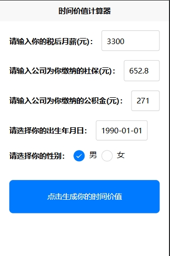
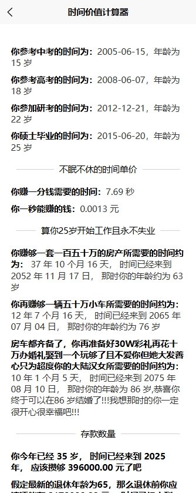

<p align="center">
    <a href='https://docs.oracle.com/en/java/javase/8'></a>
    <a href='https://docs.spring.io/spring-boot/docs/2.6.2-SNAPSHOT/reference/html'>
	</a>
    <a href='https://staging-cn.vuejs.org'></a><br/>
    <a href='#'></a>
    <a href='#'></a>
    <a href='#'></a>
    <a href='#'></a>
</p>

# 时间价值计算器

一个帮助用户计算和可视化个人时间价值的小程序。

## 功能特点

- 根据用户输入的工资计算时间单价
- 计算购房、购车、结婚等人生目标所需时间
- 展示教育考试时间线
- 计算退休前的预期存款
- 提供逃离奴籍时间预测
- 支持性别区分的结果展示

## 技术栈

- 前端框架
  - Vue 3.2.45
  - Uni-app 3.0.0
- 样式处理
  - SCSS 1.69.5
  - Sass-loader 13.3.2
- 开发语言
  - JavaScript ES6+
- 构建工具
  - HBuilderX 3.8.7
- 状态管理
  - 自定义轻量级状态管理
    ```javascript
    const store = {
        state: { calculationParams: null },
        setParams: (params) => { /* ... */ },
        clearParams: () => { /* ... */ }
    }
    ```
- UI 组件
  - uni-ui 1.4.27
- 代码规范
  - ESLint 8.39.0
  - Prettier 2.8.8

## 项目结构

### 开发环境

+ Windows

### 配置环境

+ 啥都没配置                

### 开发工具

+ [hbuilderx](https://www.dcloud.io/hbuilderx.html)

###  编码规范

- 规范方式：严格遵守阿里编码规约。
- 命名统一：简介最大程度上达到了见名知意。
- 分包明确：层级分明可快速定位到代码位置。
- 注释完整：描述性高大量减少了开发人员的代码阅读工作量。
- 工具规范：使用统一jar包避免出现内容冲突。
- 代码整洁：可读性、维护性高。

### 包的结构 

```
 src/
 ├── pages/                          # 页面文件夹
 │   ├── components/                 # 通用组件
 │   │   ├── Button.vue             # 按钮组件
 │   │   ├── Divider.vue            # 分割线组件
 │   │   ├── InputField.vue         # 输入框组件
 │   │   └── ResultItem.vue         # 结果项组件
 │   ├── index/                     # 首页模块
 │   │   ├── index.vue              # 首页主文件
 │   │   └── sections/              # 首页分区组件
 │   │       ├── ButtonGroupItem.vue # 按钮组组件
 │   │       ├── DatePickerItem.vue  # 日期选择器组件
 │   │       ├── InputFieldItem.vue  # 输入字段组组件
 │   │       └── RadioGroupItem.vue  # 单选按钮组组件
 │   └── results/                   # 结果页模块
 │       ├── Result.vue             # 结果页主文件
 │       ├── ResultMan/             # 男性结果页组件
 │       │   ├── ResultMan.vue      # 男性结果主组件
 │       │   └── sections/          # 男性结果分区组件
 │       │       ├── CountdownResults.vue    # 倒计时结果
 │       │       ├── EducationResults.vue    # 教育时间线结果
 │       │       ├── EscapeResults.vue       # 逃离奴籍结果
 │       │       ├── SavingsResults.vue      # 存款预测结果
 │       │       ├── TimePriceResults.vue    # 时间单价结果
 │       │       └── WorkResults.vue         # 工作目标结果
 │       └── ResultWoman/           # 女性结果页组件
 │           └── ResultWoman.vue    # 女性结果主组件
 ├── store/                         # 状态管理
 │   └── index.js                   # 全局状态管理文件
 ├── styles/                        # 样式文件夹
 │   └── variables.scss             # SCSS变量定义
 └── utils/                         # 工具函数
     └── calculators/               # 计算相关函数
         ├── calculateAge.js        # 年龄计算
         ├── calculateCountdown.js  # 倒计时计算
         ├── calculateEducationDates.js  # 教育日期计算
         ├── calculateSavings.js    # 存款计算
         ├── calculateTimePrice.js  # 时间单价计算
         └── calculateTimeToAchieve.js   # 目标达成时间计算
```
 
 ### 主要文件说明
 
 #### 组件
 - `Button.vue`: 自定义按钮组件，支持多种类型和状态
 - `InputField.vue`: 输入框组件，包含验证和错误提示
 - `ResultItem.vue`: 结果展示组件，支持多种数据格式
 
 #### 页面
 - `index.vue`: 首页，包含数据输入表单
 - `Result.vue`: 结果页面，根据性别显示不同结果
 - `ResultMan.vue`: 男性详细计算结果展示
 - `ResultWoman.vue`: 女性专属祝福信息展示
 
 #### 工具函数
 - `calculateAge.js`: 处理年龄相关计算
 - `calculateTimePrice.js`: 计算时间单价
 - `calculateTimeToAchieve.js`: 计算达成目标所需时间
 - `calculateSavings.js`: 计算存款预测
 
 #### 状态管理
 - `store/index.js`: 管理全局状态，处理页面间数据传递
 
 #### 样式
 - `variables.scss`: 定义全局样式变量，确保样式统一

### 项目运行

+ 运行 --> 浏览器/小程序


### 项目效果简介




### 通过此项目学到了什么

#### 一、IDEA快捷键的使用

1. 快速复制上一行代码 ctrl + D
2. 快速上或下移动当前行代码 ctrl + shift + up/dn
3. 快速删除当前行代码 ctrl + y
4. 代码格式化 ctrl + alt + L
5. IDEA跳转到指定行 ctrl + G

### 参考链接

1. [uView](https://uviewui.com/components/changeGuide.html)
2. [大厂公积金缴纳比例一览表](https://blog.csdn.net/weixin_45727359/article/details/135639219)
